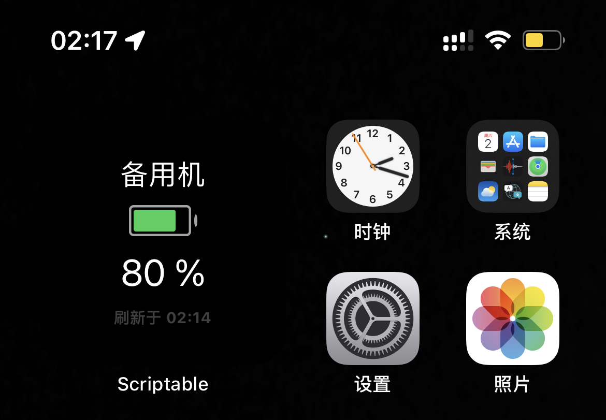
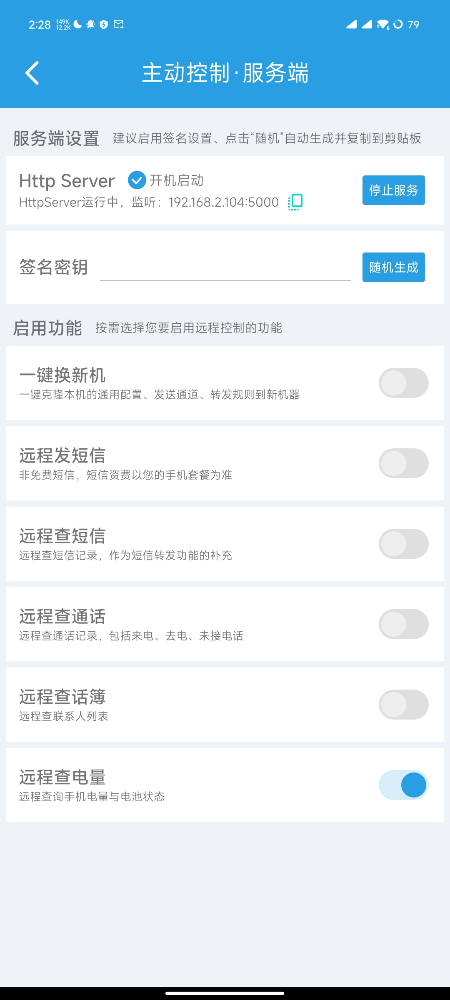
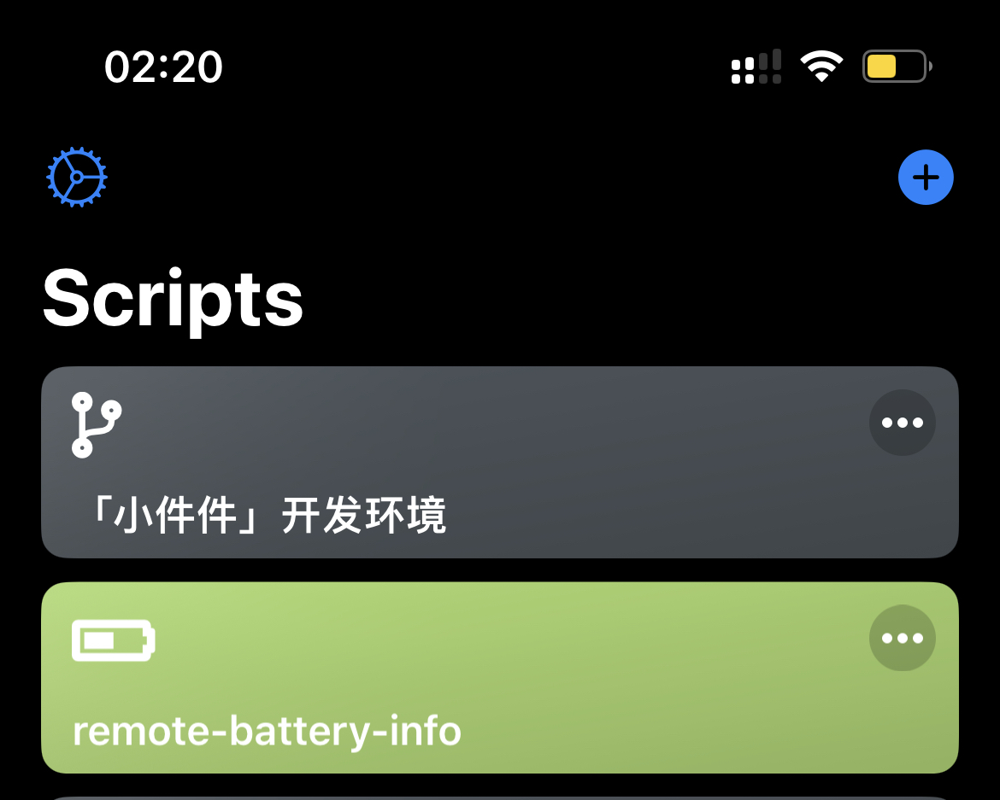
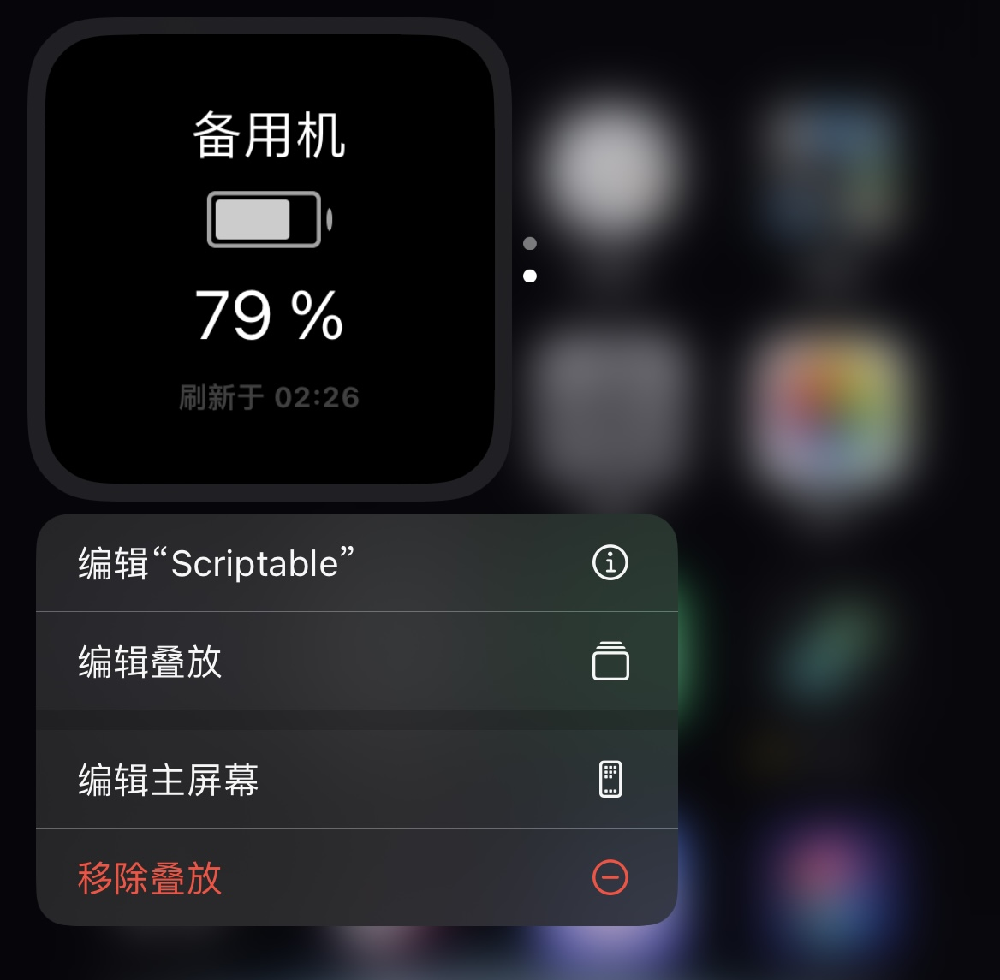
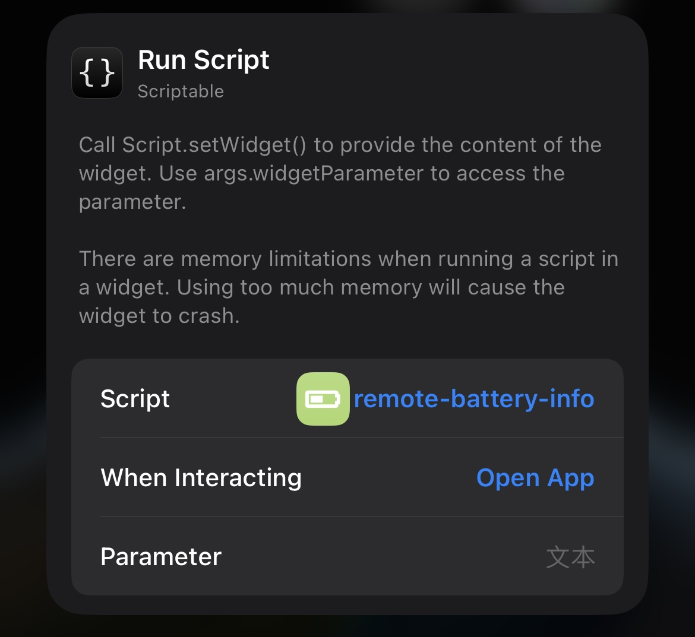

# 备用机电量

> [免责声明](https://github.com/xream/scripts/blob/main/README.md)

基于 [SmsForwarder-短信转发器](https://github.com/pppscn/SmsForwarder) 的 `主动控制` 和 `Frpc 内网穿透`

- 支持不同电量范围显示不同颜色
- 支持显示充电状态
- 点击插件设置名称和接口

<table>
  <tr>
    <td valign="top"></td>
  </tr>
</table>

# SmsForwarder-短信转发器

1. 安装 [SmsForwarder-短信转发器](https://github.com/pppscn/SmsForwarder)
2. 开启主动控制 因为我懒 所以这里没设置签名密钥 脚本也不支持签名. 所以如果不能保证接口安全, 这里启用功能不要开启除了查询电量以外的功能.

<table>
  <tr>
    <td valign="top"></td>
  </tr>
</table>

3. 查看官方文档 自己设置 [SmsForwarder-短信转发器的 Frpc 内网穿透](https://gitee.com/pp/SmsForwarder/wikis/pages?sort_id=5686031&doc_id=1821427)

假设配置完 之后公网域名是 `http://a.com:1234`

## Scriptable 脚本

1. 下载文件 放入 Scriptable

依赖: [「小件件」开发环境.js](https://raw.githubusercontent.com/xream/scripts/main/scriptable/「小件件」开发环境.js)

[remote-battery-info.js](https://raw.githubusercontent.com/xream/scripts/main/scriptable/remote-battery-info/remote-battery-info.js)

<table>
  <tr>
    <td valign="top"></td>
  </tr>
</table>

2. 桌面上设置 Scriptable

<table>
  <tr>
    <td valign="top"></td>
    <td valign="top"></td>
  </tr>
</table>

3. 点击桌面上的插件进行设置

<table>
  <tr>
    <td valign="top"></td>
  </tr>
</table>

`接口` 里填入上面配置的公网域名 `http://a.com:1234`
