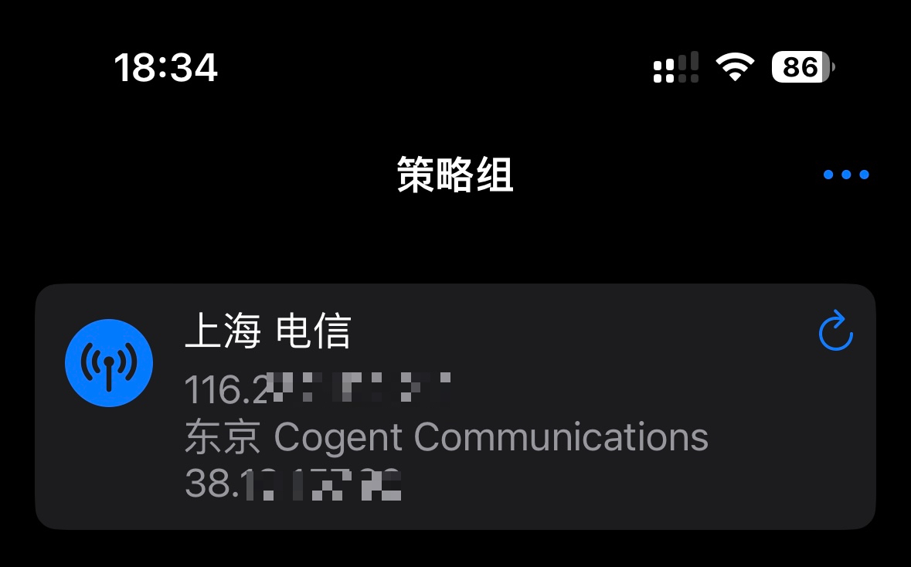
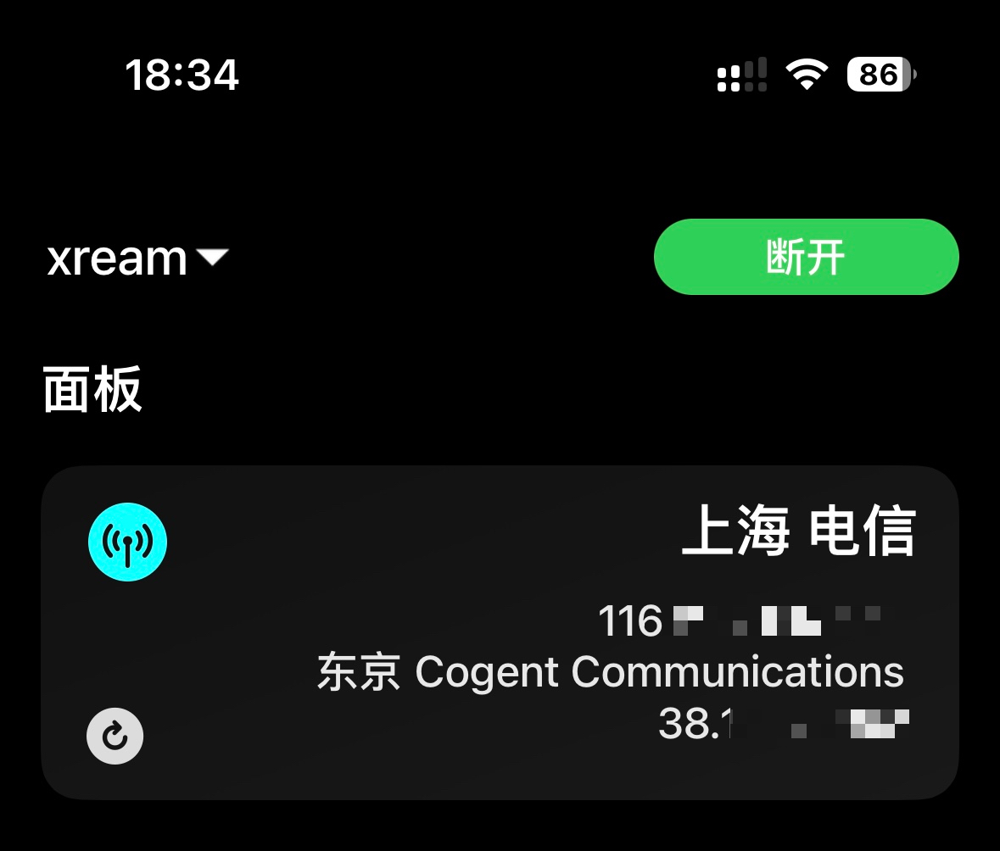

# 网络信息

> [免责声明](https://github.com/xream/scripts/blob/main/README.md)

> 欢迎加入群组 [https://t.me/zhetengsha_group](https://t.me/zhetengsha_group)

使用了 [chavyleung 大佬的 Env.js](https://github.com/chavyleung/scripts/blob/master/Env.js)

兼容 Surge, Stash

<table>
  <tr>
    <td valign="top"></td>
    <td valign="top"></td>
  </tr>
 </table>

## 直接使用 Surge 模块

[https://raw.githubusercontent.com/xream/scripts/main/surge/modules/network-info/network-info.sgmodule](https://raw.githubusercontent.com/xream/scripts/main/surge/modules/network-info/network-info.sgmodule)

## Stash 使用覆写

[https://raw.githubusercontent.com/xream/scripts/main/surge/modules/network-info/network-info.rewrite.stash.stoverride](https://raw.githubusercontent.com/xream/scripts/main/surge/modules/network-info/network-info.rewrite.stash.stoverride)

```

```
