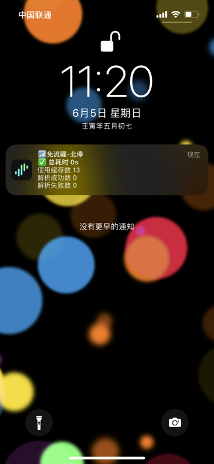
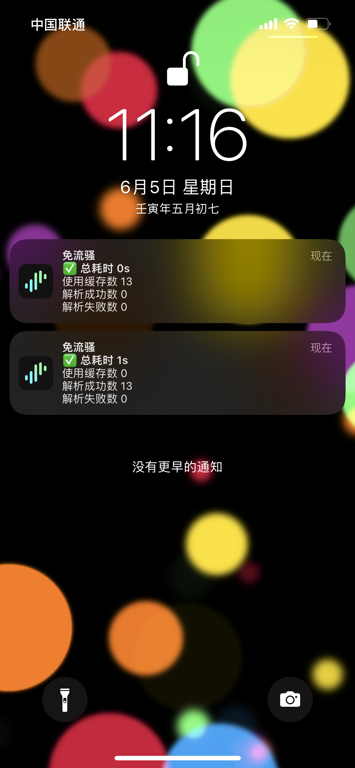
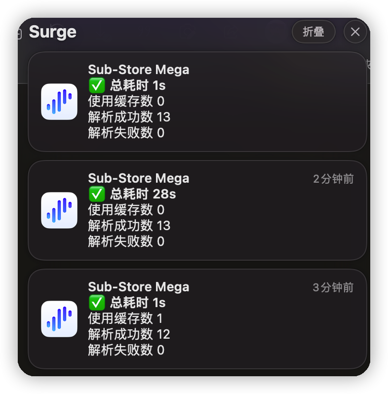
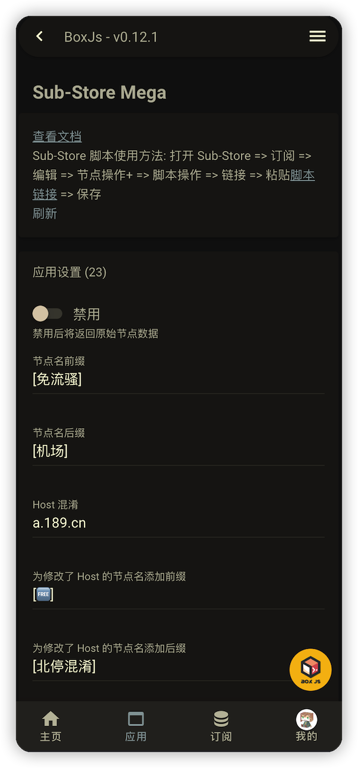
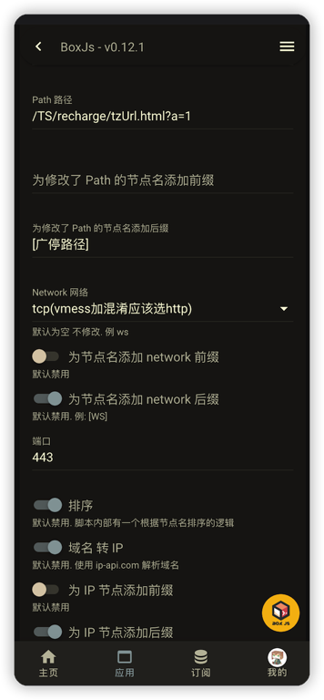
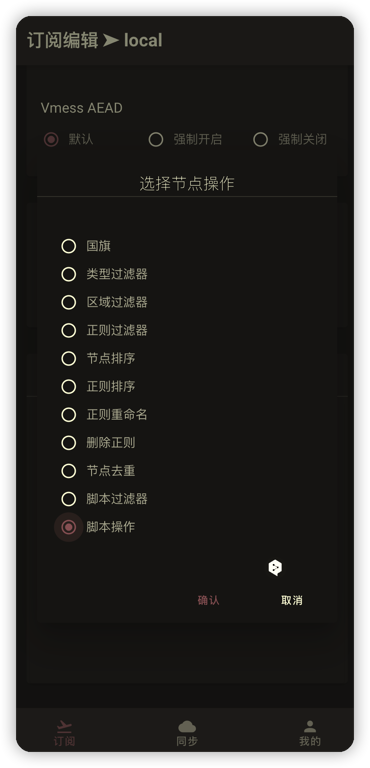
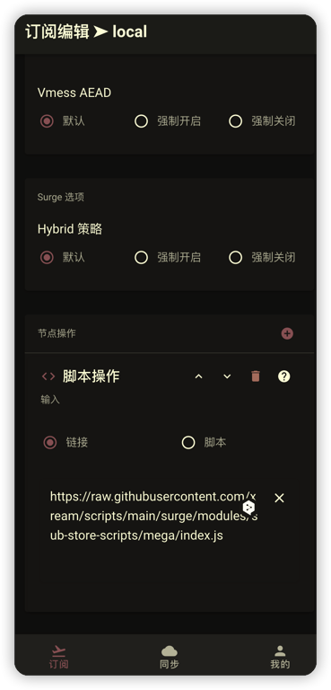
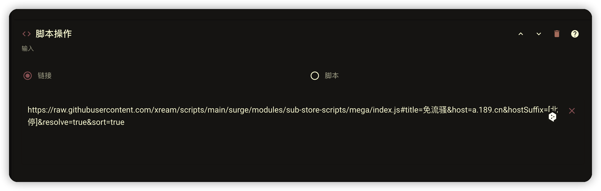

# Sub-Store Mega

> [免责声明](https://github.com/xream/scripts/blob/main/README.md)

> 欢迎加入群组 [https://t.me/zhetengsha_group](https://t.me/zhetengsha_group)

> [应该不会维护了 请使用 lite 版](https://github.com/xream/scripts/tree/main/surge/modules/sub-store-scripts/lite)

---

使用了 [chavyleung 大佬的 Env.js](https://github.com/chavyleung/scripts/blob/master/Env.js). 兼容 QuanX, Surge, Loon, Shadowrocket, Stash 等客户端

特点:

- 设置 `Host 混淆`, `端口`

- 节点服务器域名 转 IP. 对接 Cloudflare/Google/IP-API. 支持并发. 支持缓存.

- [🐞⚠️ bug 警告] 设置 `Path 路径`, 修改 `Network 网络类型`

> ⚠️ Sub-Store 对非 ws 支持不完整. 但你可以设置一个新 host 和 path ⚠️

- 节点名/Host/Path/Network/IP 的前缀/后缀

<table>
  <tr>
    <td valign="top"></td>
    <td valign="top"></td>
  </tr>
  <tr>
    <td valign="top"></td>
    <td valign="top"></td>
  </tr>
  <tr>
    <td valign="top"></td>
    <td valign="top"></td>
  </tr>
</table>

## Sub-Store 脚本使用方法

打开 Sub-Store => 订阅 => 编辑 => 节点操作+ => 脚本操作 => 链接 => 粘贴 [https://raw.githubusercontent.com/xream/scripts/main/surge/modules/sub-store-scripts/mega/index.js](https://raw.githubusercontent.com/xream/scripts/main/surge/modules/sub-store-scripts/mega/index.js) => 保存

<table>
  <tr>
    <td valign="top"></td>
    <td valign="top"></td>
  </tr>
  
</table>

## BoxJs

使用 [BoxJs 测试版](https://chavyleung.gitbook.io/boxjs) 添加 订阅 [https://raw.githubusercontent.com/xream/scripts/main/boxjs/boxjs.json](https://raw.githubusercontent.com/xream/scripts/main/boxjs/boxjs.json)

BoxJs v0.10.0 后 支持一键添加订阅 可点击尝试 [http://boxjs.com/#/sub/add/https%3A%2F%2Fraw.githubusercontent.com%2Fxream%2Fscripts%2Fmain%2Fboxjs%2Fboxjs.json](http://boxjs.com/#/sub/add/https%3A%2F%2Fraw.githubusercontent.com%2Fxream%2Fscripts%2Fmain%2Fboxjs%2Fboxjs.json)

## 配置

### BoxJs 内配置

基本上打开 BoxJs 都能看明白

## 使用脚本参数配置

<table>
  <tr>
    <td valign="top"></td>
  </tr>
</table>

引用格式如下：

例 设置 Host 混淆为 `a.189.cn`, 为修改了 Host 的节点名添加后缀 `[北停]`, 开启 `域名转 IP`, `并发数` 为 5.

`https://raw.githubusercontent.com/xream/scripts/main/surge/modules/sub-store-scripts/mega/index.js#title=免流骚&host=a.189.cn&hostSuffix=[北停]&resolve=true&concurrency=5`

参数列表如下：

`disabled` 是否禁用. 禁用后将返回原始节点数据

`concurrency` 并发数. 默认 15. 若因为并发过多导致失败, 可将此值设小

`title` 通知标题 默认为 `Sub-Store Mega`

`prefix` 节点名前缀. 默认为空. 例 [免流骚机场]

`suffix` 节点名后缀. 默认为空. 例 [全国停机]

`host` Host 混淆. 默认为空 不修改. 例 a.189.cn

`hostPrefix` 为修改了 Host 的节点名添加前缀. 默认为空

`hostSuffix` 为修改了 Host 的节点名添加后缀. 默认为空. 例 [微博混淆]

`path` Path 路径. 默认为空 不修改. 例 /TS/recharge/tzUrl.html

`pathPrefix` 为修改了 Path 的节点名添加前缀. 默认为空

`pathSuffix` 为修改了 Path 的节点名添加后缀. 默认为空. 例 [广停路径]

`network` Network 网络(所谓的 vmess tcp 加混淆应该为 http). ⚠️ Sub-Store 对非 ws 支持不完整. 但你可以设置一个新 host 和 path ⚠️ 默认为空 不修改. 例 ws

`networkPrefix` 为节点名添加 network 前缀. 默认为空

`networkSuffix` 为节点名添加 network 后缀. 默认为空 不修改. 例 443

`defaultNetworkPath` 设置 Network 网络时 默认的 Path 路径. 原始数据无 path 时, 默认设置为 /

`ipPrefix` 为 IP 节点添加前缀. 默认禁用

`ipSuffix` 为 IP 节点添加后缀. 默认禁用. 例 [1.1.1.1]

`method` method 默认为空 不修改. 例 `GET` 网络为 `http` 时, 可能需要设置此项

`port` 端口 默认为空 不修改. 例 443

`sort` 排序. 默认禁用. 脚本内部有一个我自用的根据节点名排序的逻辑 随时可能更改

`resolve` 域名 转 IP. 默认禁用. 使用网络请求解析域名

`resolver` 域名 转 IP 服务. `cloudflare`/`google`/`ip-api`

`sleep` 域名解析等待时间(单位 秒). 因为网络请求的接口一般有频次限制 默认每次查询间隔 0 秒

`expire` 域名解析结果缓存时间(单位 秒). 默认 1800 秒(30 分钟). 若 <= 0 则不缓存

`cacheMaxSize` 域名解析结果缓存最大数. 默认 100

`notifyOnSuccessDisabled` 禁用成功后的通知. 默认会在成功后发送通知

`clearCache` 下次清除缓存. 默认禁用. 启用后下次将清除缓存, 然后自动禁用
